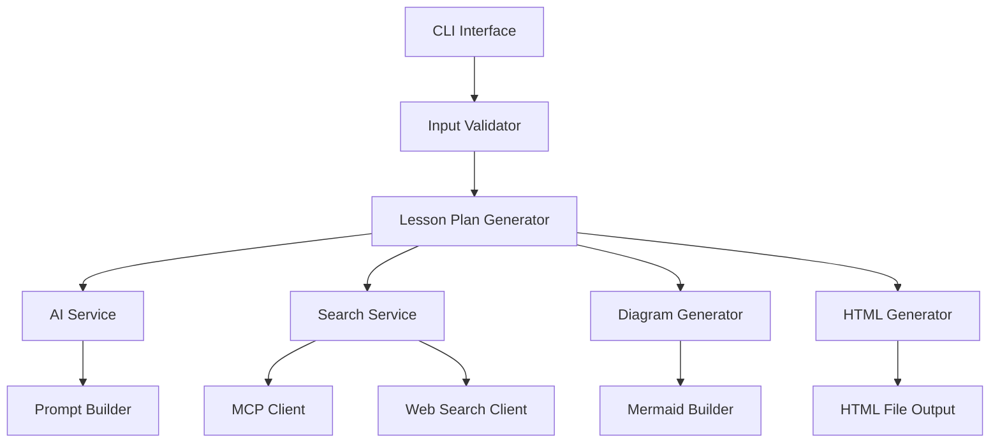

# 技術設計書（Design Specification）

## プロジェクト名
**BlueprintEmulator（ブループリントエミュレーター）**
UE5.6教案自動生成システム

**バージョン**: 1.0
**対象**: Phase 1 (PoC)
**作成日**: 2025-11-11

---

## 1. システムアーキテクチャ

### 1.1 全体構成

```
┌─────────────────────────────────────────────────────────┐
│                    User Interface Layer                  │
│              (CLI / Simple Web Form - Phase 1)           │
└────────────────────┬────────────────────────────────────┘
                     │
                     ▼
┌─────────────────────────────────────────────────────────┐
│                  Application Layer                       │
│  ┌────────────────┐  ┌──────────────────────────────┐  │
│  │ Theme Input    │  │  Lesson Plan Generator       │  │
│  │ Validator      │  │  (Core Engine)               │  │
│  └────────────────┘  └──────────────────────────────┘  │
└────────────────────┬────────────────────────────────────┘
                     │
                     ▼
┌─────────────────────────────────────────────────────────┐
│                  Service Layer                           │
│  ┌──────────────┐  ┌──────────────┐  ┌──────────────┐ │
│  │ AI Service   │  │ Search       │  │ Diagram      │ │
│  │ (GPT/Claude) │  │ Service      │  │ Generator    │ │
│  │              │  │ (MCP/Web)    │  │ (Mermaid.js) │ │
│  └──────────────┘  └──────────────┘  └──────────────┘ │
└────────────────────┬────────────────────────────────────┘
                     │
                     ▼
┌─────────────────────────────────────────────────────────┐
│                  Data Layer                              │
│  ┌──────────────┐  ┌──────────────┐  ┌──────────────┐ │
│  │ Theme        │  │ Diagram      │  │ Knowledge    │ │
│  │ Templates    │  │ Templates    │  │ Base         │ │
│  │ (JSON)       │  │ (JSON)       │  │ (JSON)       │ │
│  └──────────────┘  └──────────────┘  └──────────────┘ │
└────────────────────┬────────────────────────────────────┘
                     │
                     ▼
┌─────────────────────────────────────────────────────────┐
│                  Output Layer                            │
│                 HTML Generator                           │
│         (with Mermaid.js & Print CSS)                    │
└─────────────────────────────────────────────────────────┘
```

### 1.2 技術スタック

| レイヤー | 技術 |
|---------|------|
| **言語** | TypeScript 5.x, Node.js 20.x |
| **UI** | CLI (Phase 1), 将来的にNext.js |
| **AI** | OpenAI GPT-4 API / Anthropic Claude API |
| **検索** | MCP, Web Search API (Google/Bing) |
| **図生成** | Mermaid.js (CDN) |
| **データ** | JSON (ファイルベース) |
| **HTML** | テンプレートエンジン不使用（文字列ビルダー） |
| **CSS** | カスタムCSS + @media print |

---

## 2. コンポーネント設計

### 2.1 コンポーネント一覧



### 2.2 各コンポーネントの詳細

#### 2.2.1 CLI Interface
- **責務**: ユーザーからのテーマ入力を受け付ける
- **ファイル**: `src/cli/index.ts`
- **主要メソッド**:
  - `run()`: CLIアプリケーションのエントリーポイント
  - `promptForTheme()`: テーマ入力プロンプト表示
  - `displayProgress()`: 進捗表示

#### 2.2.2 Input Validator
- **責務**: 入力されたテーマの妥当性を検証
- **ファイル**: `src/validators/inputValidator.ts`
- **主要メソッド**:
  - `validate(theme: string): ValidationResult`
  - `isUE5Related(theme: string): boolean`
  - `isAppropriateForHighSchool(theme: string): boolean`

#### 2.2.3 Lesson Plan Generator (コアエンジン)
- **責務**: 教案生成の全体的なオーケストレーション
- **ファイル**: `src/core/lessonPlanGenerator.ts`
- **主要メソッド**:
  - `generate(theme: string): Promise<LessonPlan>`
  - `generateSections(): Promise<Section[]>`
  - `enrichWithLatestInfo(): Promise<void>`

#### 2.2.4 AI Service
- **責tbody**: AI APIを使った教案コンテンツの生成
- **ファイル**: `src/services/aiService.ts`
- **主要メソッド**:
  - `generateContent(prompt: string): Promise<string>`
  - `generateSection(sectionType: SectionType, context: Context): Promise<string>`
- **使用API**: OpenAI GPT-4 または Anthropic Claude
- **設定**:
  - Temperature: 0.7 (創造性と正確性のバランス)
  - Max Tokens: 3000 (セクションあたり)

#### 2.2.5 Search Service
- **責務**: UE5.6の最新情報を検索・取得
- **ファイル**: `src/services/searchService.ts`
- **主要メソッド**:
  - `searchLatestInfo(query: string): Promise<SearchResult[]>`
  - `filterByVersion(results: SearchResult[], version: string): SearchResult[]`
  - `extractReferences(results: SearchResult[]): Reference[]`

#### 2.2.6 MCP Client
- **責務**: Model Context Protocolを使ったドキュメント取得
- **ファイル**: `src/services/mcpClient.ts`
- **主要メソッド**:
  - `fetchDocument(url: string): Promise<Document>`
  - `searchDocumentation(keyword: string): Promise<Document[]>`

#### 2.2.7 Web Search Client
- **責務**: Web検索APIを使った情報取得
- **ファイル**: `src/services/webSearchClient.ts`
- **主要メソッド**:
  - `search(query: string): Promise<WebSearchResult[]>`
  - `buildQuery(theme: string): string`
- **検索クエリ例**:
  - `"Unreal Engine 5.6 Control Rig tutorial"`
  - `"UE5.6 Blueprint Timeline animation"`

#### 2.2.8 Diagram Generator
- **責務**: Mermaid.js形式の図を生成
- **ファイル**: `src/generators/diagramGenerator.ts`
- **主要メソッド**:
  - `generateBlueprintDiagram(nodes: Node[], connections: Connection[]): string`
  - `generateTimelineDiagram(timeline: Timeline): string`
  - `generateAnimationBlueprintDiagram(states: State[]): string`
- **出力形式**: Mermaid.js構文の文字列

#### 2.2.9 HTML Generator
- **責務**: 教案をHTMLに変換
- **ファイル**: `src/generators/htmlGenerator.ts`
- **主要メソッド**:
  - `generate(lessonPlan: LessonPlan): string`
  - `generateHead(): string`
  - `generateBody(sections: Section[]): string`
  - `embedMermaidDiagrams(diagrams: Diagram[]): string`
  - `generatePrintCSS(): string`

---

## 3. データモデル

### 3.1 コアデータ構造

```typescript
// 教案全体
interface LessonPlan {
  id: string;
  title: string;
  theme: string;
  targetVersion: string; // "5.6"
  createdAt: Date;
  sections: Section[];
  diagrams: Diagram[];
  references: Reference[];
}

// セクション
interface Section {
  id: string;
  type: SectionType;
  title: string;
  content: string;
  order: number;
}

enum SectionType {
  LEARNING_OBJECTIVES = "learning_objectives",
  PREREQUISITES = "prerequisites",
  FEATURES_USED = "features_used",
  IMPLEMENTATION_STEPS = "implementation_steps",
  BLUEPRINT_IMPLEMENTATION = "blueprint_implementation",
  SETTINGS = "settings",
  DIAGRAMS = "diagrams",
  TROUBLESHOOTING = "troubleshooting",
  ADVANCED_CHALLENGES = "advanced_challenges",
  REFERENCES = "references"
}

// 図
interface Diagram {
  id: string;
  type: DiagramType;
  title: string;
  mermaidCode: string;
  description: string;
}

enum DiagramType {
  BLUEPRINT_FLOW = "blueprint_flow",
  ANIMATION_BLUEPRINT = "animation_blueprint",
  TIMELINE = "timeline",
  STATE_MACHINE = "state_machine"
}

// 参考文献
interface Reference {
  title: string;
  url: string;
  version: string; // "5.6"
  description: string;
}

// 検索結果
interface SearchResult {
  title: string;
  url: string;
  snippet: string;
  version?: string;
  relevanceScore: number;
}

// バリデーション結果
interface ValidationResult {
  isValid: boolean;
  errors: string[];
  warnings: string[];
}
```

### 3.2 テーマテンプレート (JSON)

```json
{
  "themes": [
    {
      "id": "control-rig-animation",
      "name": "コントロールリグを使った自作アニメーション",
      "description": "UE5.6のコントロールリグ機能を使って独自アニメーションを作成",
      "targetVersion": "5.6",
      "difficulty": "intermediate",
      "estimatedTime": "2-3 hours",
      "keywords": ["Control Rig", "Animation", "IK", "FK"],
      "prerequisiteTopics": [
        "基本的なUE5の操作",
        "アクタとコンポーネントの理解"
      ],
      "learningObjectives": [
        "コントロールリグの基本概念を理解する",
        "リグの設定とキーフレームアニメーションを作成できる"
      ],
      "diagramTemplates": [
        {
          "type": "blueprint_flow",
          "description": "アニメーション再生のブループリントフロー"
        }
      ]
    },
    {
      "id": "special-move-effects",
      "name": "必殺技演出の作成",
      "description": "アニメーションとエフェクトを組み合わせた必殺技演出を実装",
      "targetVersion": "5.6",
      "difficulty": "intermediate",
      "estimatedTime": "3-4 hours",
      "keywords": ["Animation", "VFX", "Niagara", "Timeline", "Camera"],
      "prerequisiteTopics": [
        "コントロールリグの基礎",
        "ブループリントの基本"
      ],
      "learningObjectives": [
        "タイムライン機能を使った演出制御",
        "パーティクルエフェクトの追加",
        "カメラワークの演出"
      ],
      "diagramTemplates": [
        {
          "type": "blueprint_flow",
          "description": "必殺技発動のブループリント"
        },
        {
          "type": "timeline",
          "description": "演出タイムライン"
        }
      ]
    }
  ]
}
```

---

## 4. AIプロンプト設計

### 4.1 プロンプト構造

```typescript
interface PromptTemplate {
  systemPrompt: string;
  userPrompt: string;
  context: Context;
}

interface Context {
  theme: string;
  targetVersion: string;
  sectionType: SectionType;
  latestInfo: SearchResult[];
  themeTemplate?: ThemeTemplate;
}
```

### 4.2 セクション別プロンプト例

#### 学習目標セクション
```
System Prompt:
あなたはUnreal Engine 5.6の専門家であり、高校生向けの教案を作成する教育者です。
明確で、段階的で、実践的な学習目標を提示してください。

User Prompt:
テーマ: {theme}
対象バージョン: UE5.6
以下の最新情報を参考にしてください:
{latestInfo}

このテーマの学習目標を3-5個、箇条書きで作成してください。
各目標は具体的で測定可能であり、高校生が理解できる言葉で記述してください。
古いバージョン（UE5.5以前）の情報は使用しないでください。
```

#### ブループリント実装セクション
```
System Prompt:
あなたはUnreal Engine 5.6のブループリント専門家です。
高校生が実際に実装できる、具体的で詳細なブループリント手順を提供してください。

User Prompt:
テーマ: {theme}
対象バージョン: UE5.6
以下の最新情報を参考にしてください:
{latestInfo}

このテーマを実現するためのブループリント実装手順を作成してください:
1. 必要なブループリントクラスの作成
2. 各ノードの配置と接続（具体的なノード名を記載）
3. 変数や関数の設定
4. 実装のポイントと注意点

UE5.6で推奨される最新の手法を使用してください。
非推奨の機能がある場合は、代替手段を明記してください。
```

#### 図解セクション
```
System Prompt:
あなたはUnreal Engine 5.6のブループリント構造を視覚化する専門家です。
Mermaid.js形式でブループリントのフローチャートを作成してください。

User Prompt:
テーマ: {theme}
ブループリント実装: {blueprintImplementation}

以下のブループリント実装をMermaid.js形式のフローチャートで表現してください:
- graph LR形式を使用
- ノード名は日本語でわかりやすく
- 接続線には条件分岐がある場合、ラベルを付ける
- 高校生が理解しやすいシンプルな構造

例:
graph LR
    A[入力イベント] --> B{条件分岐}
    B -->|True| C[アニメーション再生]
    B -->|False| D[何もしない]
    C --> E[エフェクト発生]
```

---

## 5. 検索サービス設計

### 5.1 検索戦略

```typescript
class SearchService {
  async searchLatestInfo(theme: string): Promise<SearchResult[]> {
    // 1. MCPでUE5.6公式ドキュメントを検索
    const mcpResults = await this.mcpClient.search(theme, "5.6");

    // 2. Web検索APIで最新情報を検索
    const webQuery = this.buildUE56Query(theme);
    const webResults = await this.webSearchClient.search(webQuery);

    // 3. 結果をマージしてバージョンフィルタリング
    const allResults = [...mcpResults, ...webResults];
    const filtered = this.filterByVersion(allResults, "5.6");

    // 4. 関連性スコアでソート
    return this.sortByRelevance(filtered);
  }

  private buildUE56Query(theme: string): string {
    // UE5.6専用クエリを構築
    return `"Unreal Engine 5.6" OR "UE5.6" ${theme} -"5.5" -"5.4" -"5.3" -"5.2" -"5.1" -"5.0" -"UE4"`;
  }

  private filterByVersion(results: SearchResult[], version: string): SearchResult[] {
    return results.filter(result => {
      // URLやコンテンツにバージョン情報があるかチェック
      const hasCorrectVersion = result.url.includes(version) ||
                                 result.snippet.includes(version);
      const hasOldVersion = /5\.[0-5]|UE4/.test(result.snippet);

      return hasCorrectVersion && !hasOldVersion;
    });
  }
}
```

### 5.2 検索クエリパターン

| テーマ | 検索クエリ |
|--------|-----------|
| Control Rig | `"UE5.6" "Control Rig" tutorial setup -"5.5" -"UE4"` |
| Timeline | `"Unreal Engine 5.6" "Timeline" Blueprint animation` |
| Niagara VFX | `"UE5.6" Niagara particle system tutorial` |

---

## 6. Mermaid.js統合設計

### 6.1 図生成ロジック

```typescript
class DiagramGenerator {
  generateBlueprintDiagram(implementation: string): Diagram {
    // AIから取得したブループリント実装テキストを解析
    const nodes = this.extractNodes(implementation);
    const connections = this.extractConnections(implementation);

    // Mermaid.js構文を生成
    const mermaidCode = this.buildMermaidGraph(nodes, connections);

    return {
      id: generateId(),
      type: DiagramType.BLUEPRINT_FLOW,
      title: "ブループリント構造図",
      mermaidCode,
      description: "このブループリントの全体的なフロー"
    };
  }

  private buildMermaidGraph(nodes: Node[], connections: Connection[]): string {
    let mermaid = "graph LR\n";

    // ノードを追加
    nodes.forEach((node, index) => {
      const shape = this.getNodeShape(node.type);
      mermaid += `    ${node.id}${shape[0]}${node.label}${shape[1]}\n`;
    });

    // 接続を追加
    connections.forEach(conn => {
      const arrow = conn.label ? `-->|${conn.label}|` : '-->';
      mermaid += `    ${conn.from} ${arrow} ${conn.to}\n`;
    });

    return mermaid;
  }

  private getNodeShape(type: NodeType): [string, string] {
    switch(type) {
      case NodeType.EVENT: return ['[', ']'];      // 矩形
      case NodeType.CONDITION: return ['{', '}'];  // ダイヤモンド
      case NodeType.ACTION: return ['[', ']'];     // 矩形
      case NodeType.FUNCTION: return ['[[', ']]']; // サブルーチン
      default: return ['[', ']'];
    }
  }
}
```

### 6.2 HTML埋め込み

```html
<!DOCTYPE html>
<html lang="ja">
<head>
  <meta charset="UTF-8">
  <title>UE5.6 教案: {title}</title>
  <script src="https://cdn.jsdelivr.net/npm/mermaid@10/dist/mermaid.min.js"></script>
  <script>
    mermaid.initialize({
      startOnLoad: true,
      theme: 'default',
      flowchart: {
        useMaxWidth: true,
        htmlLabels: true,
        curve: 'basis'
      }
    });
  </script>
  <style>
    /* 印刷時のMermaid図調整 */
    @media print {
      .mermaid {
        page-break-inside: avoid;
        max-width: 100%;
      }
    }
  </style>
</head>
<body>
  <div class="diagram-section">
    <h3>ブループリント構造図</h3>
    <div class="mermaid">
      {mermaidCode}
    </div>
  </div>
</body>
</html>
```

---

## 7. HTML生成設計

### 7.1 HTMLテンプレート構造

```typescript
class HTMLGenerator {
  generate(lessonPlan: LessonPlan): string {
    return `
<!DOCTYPE html>
<html lang="ja">
${this.generateHead(lessonPlan)}
${this.generateBody(lessonPlan)}
</html>
    `;
  }

  private generateHead(lessonPlan: LessonPlan): string {
    return `
<head>
  <meta charset="UTF-8">
  <meta name="viewport" content="width=device-width, initial-scale=1.0">
  <title>${lessonPlan.title} - UE5.6教案</title>
  ${this.generateStylesheet()}
  ${this.generateMermaidScript()}
</head>
    `;
  }

  private generateStylesheet(): string {
    return `
<style>
  /* 基本スタイル */
  * { margin: 0; padding: 0; box-sizing: border-box; }
  body {
    font-family: 'Segoe UI', 'Yu Gothic', 'Meiryo', sans-serif;
    font-size: 11pt;
    line-height: 1.8;
    color: #333;
    max-width: 210mm; /* A4幅 */
    margin: 0 auto;
    padding: 20mm;
    background: #fff;
  }

  h1 { font-size: 20pt; margin-bottom: 10mm; border-bottom: 3px solid #0078d4; padding-bottom: 5mm; }
  h2 { font-size: 16pt; margin-top: 8mm; margin-bottom: 4mm; color: #0078d4; }
  h3 { font-size: 13pt; margin-top: 6mm; margin-bottom: 3mm; }

  p { margin-bottom: 3mm; }
  ul, ol { margin-left: 6mm; margin-bottom: 4mm; }
  li { margin-bottom: 2mm; }

  code {
    background: #f5f5f5;
    padding: 1mm 2mm;
    border-radius: 1mm;
    font-family: 'Consolas', 'Courier New', monospace;
    font-size: 10pt;
  }

  pre {
    background: #f5f5f5;
    padding: 4mm;
    border-radius: 2mm;
    overflow-x: auto;
    margin-bottom: 4mm;
  }

  .mermaid {
    text-align: center;
    margin: 6mm 0;
    padding: 4mm;
    background: #fafafa;
    border: 1px solid #e0e0e0;
    border-radius: 2mm;
  }

  .reference-link {
    color: #0078d4;
    text-decoration: none;
    word-break: break-all;
  }

  .version-badge {
    display: inline-block;
    background: #0078d4;
    color: white;
    padding: 1mm 3mm;
    border-radius: 2mm;
    font-size: 9pt;
    font-weight: bold;
  }

  /* 印刷用スタイル */
  @media print {
    @page {
      size: A4;
      margin: 15mm;
    }

    body {
      padding: 0;
      max-width: 100%;
    }

    h1, h2, h3 {
      page-break-after: avoid;
    }

    .mermaid {
      page-break-inside: avoid;
    }

    pre, code {
      page-break-inside: avoid;
    }

    .reference-link {
      color: #0078d4;
    }

    .reference-link::after {
      content: " (" attr(href) ")";
      font-size: 9pt;
      color: #666;
    }
  }
</style>
    `;
  }
}
```

### 7.2 セクション生成

```typescript
private generateBody(lessonPlan: LessonPlan): string {
  return `
<body>
  <header>
    <h1>${lessonPlan.title}</h1>
    <p>
      <span class="version-badge">UE5.6対応</span>
      作成日: ${this.formatDate(lessonPlan.createdAt)}
    </p>
  </header>

  <main>
    ${this.generateSections(lessonPlan.sections)}
    ${this.generateDiagrams(lessonPlan.diagrams)}
    ${this.generateReferences(lessonPlan.references)}
  </main>
</body>
  `;
}
```

---

## 8. エラーハンドリング

### 8.1 エラー分類

```typescript
enum ErrorType {
  VALIDATION_ERROR = "VALIDATION_ERROR",
  AI_SERVICE_ERROR = "AI_SERVICE_ERROR",
  SEARCH_SERVICE_ERROR = "SEARCH_SERVICE_ERROR",
  GENERATION_ERROR = "GENERATION_ERROR",
  OUTPUT_ERROR = "OUTPUT_ERROR"
}

class AppError extends Error {
  constructor(
    public type: ErrorType,
    public message: string,
    public details?: unknown
  ) {
    super(message);
    this.name = 'AppError';
  }
}
```

### 8.2 エラーハンドリング戦略

```typescript
class LessonPlanGenerator {
  async generate(theme: string): Promise<LessonPlan> {
    try {
      // 1. 入力バリデーション
      const validation = this.validator.validate(theme);
      if (!validation.isValid) {
        throw new AppError(
          ErrorType.VALIDATION_ERROR,
          "入力テーマが無効です",
          validation.errors
        );
      }

      // 2. 最新情報検索（タイムアウト付き）
      const searchResults = await this.withTimeout(
        this.searchService.searchLatestInfo(theme),
        10000, // 10秒
        "検索がタイムアウトしました"
      );

      // 3. AI生成（リトライ機能付き）
      const sections = await this.withRetry(
        () => this.generateSections(theme, searchResults),
        3, // 最大3回リトライ
        "教案生成に失敗しました"
      );

      // 4. 図生成（エラー時はスキップ）
      const diagrams = await this.generateDiagramsSafely(sections);

      return {
        id: generateId(),
        title: this.generateTitle(theme),
        theme,
        targetVersion: "5.6",
        createdAt: new Date(),
        sections,
        diagrams,
        references: this.extractReferences(searchResults)
      };

    } catch (error) {
      if (error instanceof AppError) {
        throw error;
      }
      throw new AppError(
        ErrorType.GENERATION_ERROR,
        "予期しないエラーが発生しました",
        error
      );
    }
  }

  private async withTimeout<T>(
    promise: Promise<T>,
    timeoutMs: number,
    errorMessage: string
  ): Promise<T> {
    return Promise.race([
      promise,
      new Promise<T>((_, reject) =>
        setTimeout(() => reject(new Error(errorMessage)), timeoutMs)
      )
    ]);
  }

  private async withRetry<T>(
    fn: () => Promise<T>,
    maxRetries: number,
    errorMessage: string
  ): Promise<T> {
    let lastError: Error;

    for (let i = 0; i < maxRetries; i++) {
      try {
        return await fn();
      } catch (error) {
        lastError = error as Error;
        if (i < maxRetries - 1) {
          await this.delay(1000 * (i + 1)); // 指数バックオフ
        }
      }
    }

    throw new AppError(
      ErrorType.AI_SERVICE_ERROR,
      errorMessage,
      lastError!
    );
  }
}
```

---

## 9. パフォーマンス最適化

### 9.1 並列処理

```typescript
async generateSections(theme: string, searchResults: SearchResult[]): Promise<Section[]> {
  const sectionTypes = [
    SectionType.LEARNING_OBJECTIVES,
    SectionType.PREREQUISITES,
    SectionType.FEATURES_USED,
    // ... 他のセクション
  ];

  // セクションを並列生成
  const sectionPromises = sectionTypes.map(type =>
    this.aiService.generateSection(type, { theme, searchResults })
  );

  const sections = await Promise.all(sectionPromises);

  return sections.map((content, index) => ({
    id: generateId(),
    type: sectionTypes[index],
    title: this.getSectionTitle(sectionTypes[index]),
    content,
    order: index
  }));
}
```

### 9.2 キャッシング

```typescript
class CacheService {
  private cache = new Map<string, { data: unknown; expiry: number }>();

  set(key: string, data: unknown, ttlMs: number): void {
    this.cache.set(key, {
      data,
      expiry: Date.now() + ttlMs
    });
  }

  get<T>(key: string): T | null {
    const item = this.cache.get(key);
    if (!item) return null;

    if (Date.now() > item.expiry) {
      this.cache.delete(key);
      return null;
    }

    return item.data as T;
  }
}

// 使用例
class SearchService {
  constructor(private cache: CacheService) {}

  async searchLatestInfo(theme: string): Promise<SearchResult[]> {
    const cacheKey = `search:${theme}:5.6`;

    // キャッシュチェック
    const cached = this.cache.get<SearchResult[]>(cacheKey);
    if (cached) return cached;

    // 実際の検索
    const results = await this.performSearch(theme);

    // キャッシュに保存（1時間）
    this.cache.set(cacheKey, results, 3600000);

    return results;
  }
}
```

---

## 10. セキュリティ考慮事項

### 10.1 APIキー管理

```typescript
// 環境変数から読み込み
const config = {
  openaiApiKey: process.env.OPENAI_API_KEY,
  anthropicApiKey: process.env.ANTHROPIC_API_KEY,
  searchApiKey: process.env.SEARCH_API_KEY
};

// バリデーション
function validateConfig() {
  if (!config.openaiApiKey && !config.anthropicApiKey) {
    throw new Error("AI APIキーが設定されていません");
  }
}
```

### 10.2 入力サニタイゼーション

```typescript
class InputSanitizer {
  sanitize(input: string): string {
    // HTMLタグを除去
    let sanitized = input.replace(/<[^>]*>/g, '');

    // スクリプトインジェクション対策
    sanitized = sanitized.replace(/<script\b[^<]*(?:(?!<\/script>)<[^<]*)*<\/script>/gi, '');

    // 長さ制限（1000文字）
    sanitized = sanitized.slice(0, 1000);

    return sanitized.trim();
  }
}
```

---

## 11. ファイル構造

```
BlueprintEmulator/
├── src/
│   ├── cli/
│   │   └── index.ts                    # CLIエントリーポイント
│   ├── core/
│   │   └── lessonPlanGenerator.ts      # コア生成エンジン
│   ├── services/
│   │   ├── aiService.ts                # AI API連携
│   │   ├── searchService.ts            # 検索サービス
│   │   ├── mcpClient.ts                # MCPクライアント
│   │   ├── webSearchClient.ts          # Web検索クライアント
│   │   └── cacheService.ts             # キャッシュ管理
│   ├── generators/
│   │   ├── diagramGenerator.ts         # Mermaid図生成
│   │   └── htmlGenerator.ts            # HTML生成
│   ├── validators/
│   │   └── inputValidator.ts           # 入力バリデーション
│   ├── models/
│   │   ├── lessonPlan.ts               # データモデル定義
│   │   └── errors.ts                   # エラー定義
│   ├── utils/
│   │   ├── promptBuilder.ts            # プロンプト構築
│   │   ├── inputSanitizer.ts           # サニタイゼーション
│   │   └── helpers.ts                  # ヘルパー関数
│   └── config/
│       ├── config.ts                   # 設定管理
│       └── constants.ts                # 定数定義
├── data/
│   ├── themes/
│   │   └── themes.json                 # テーマテンプレート
│   ├── diagrams/
│   │   └── templates.json              # 図テンプレート
│   └── knowledge/
│       └── ue5-features.json           # UE5機能ナレッジベース
├── output/
│   └── [generated-html-files]          # 生成されたHTML
├── tests/
│   ├── unit/
│   └── integration/
├── package.json
├── tsconfig.json
├── .env.example
└── README.md
```

---

## 12. 環境変数設定

```bash
# .env.example
# AI API Keys (いずれか1つは必須)
OPENAI_API_KEY=sk-...
ANTHROPIC_API_KEY=sk-ant-...

# Search API Keys (オプション)
GOOGLE_SEARCH_API_KEY=...
GOOGLE_SEARCH_ENGINE_ID=...

# Application Settings
TARGET_UE_VERSION=5.6
MAX_GENERATION_TIME_MS=30000
CACHE_TTL_MS=3600000

# Output Settings
OUTPUT_DIR=./output
```

---

## 13. 依存パッケージ

```json
{
  "dependencies": {
    "openai": "^4.0.0",
    "@anthropic-ai/sdk": "^0.9.0",
    "axios": "^1.6.0",
    "dotenv": "^16.3.0",
    "commander": "^11.0.0",
    "chalk": "^5.3.0",
    "ora": "^7.0.0"
  },
  "devDependencies": {
    "typescript": "^5.3.0",
    "@types/node": "^20.0.0",
    "tsx": "^4.0.0",
    "vitest": "^1.0.0"
  }
}
```

---

## 14. 次のステップ

1. **テスト設計**: 各コンポーネントの単体テストとE2Eテストを設計
2. **タスク分解**: 実装タスクを具体的な作業単位に分解
3. **実装**: 設計に基づいて順次実装
4. **検証**: 生成された教案の品質を実際の教室で検証

---

**設計完了日**: 2025-11-11
**次フェーズ**: テスト設計（Test Design）
